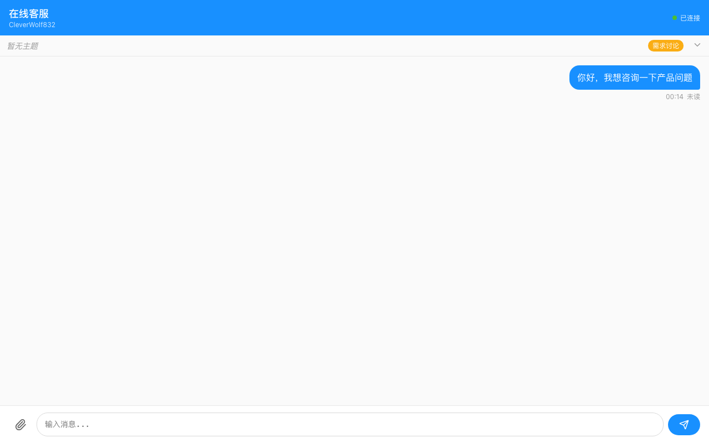
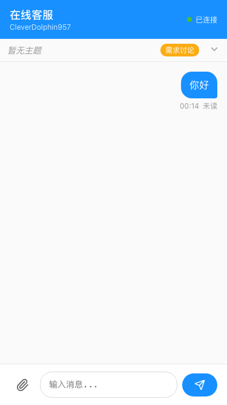

# 在线客服聊天系统

一个功能完整的实时客服聊天系统，基于 React + Hono + SQLite 构建，支持 PC 端和移动端。

## 功能特性

- **实时聊天** - 基于 SSE 的实时消息推送
- **文件上传** - 支持图片、视频、文件上传与预览
- **任务进度** - 5阶段任务状态管理
- **排队系统** - 用户排队查询，客服任务队列
- **主题设置** - 会话主题设置与显示
- **Bark通知** - iOS 推送通知集成
- **响应式设计** - PC/移动端自适应

## 界面预览

### 用户端

**PC 端聊天界面：**



**移动端聊天界面：**



### 客服端

**PC 端工作台：**


**移动端工作台：**


## 技术栈

| 类别 | 技术 |
|------|------|
| 前端 | React 19, TypeScript, Vite |
| 后端 | Hono, Node.js |
| 数据库 | SQLite (node:sqlite) |
| 状态管理 | Zustand |
| 实时通信 | Server-Sent Events |
| 类型安全 | 全栈 TypeScript 类型共享 |

## 快速开始

### 安装

```bash
npm install
```

### 开发

```bash
npm run dev
```

应用将在 http://localhost:3010 启动

- **用户端**: http://localhost:3010/chat
- **客服端**: http://localhost:3010/staff

### 构建

```bash
npm run build
```

### 测试

```bash
npm test
```

## 项目结构

```
src/
├── client/               # React 前端
│   ├── components/       # UI 组件
│   │   ├── chat/         # 用户端组件
│   │   └── staff/        # 客服端组件
│   ├── pages/            # 页面组件
│   ├── stores/           # Zustand 状态管理
│   └── services/         # API 客户端
├── server/               # Hono 后端
│   ├── module-chat/      # 聊天模块
│   ├── module-staff/     # 客服模块
│   └── services/         # 服务层
└── shared/               # 共享类型
    ├── types.ts
    └── schemas.ts
```

## 核心功能

### 任务进度管理

会话支持5个任务状态：

```
需求讨论 → 需求确认 → 执行中 → 交付 → 评价
```

客服可点击进度条切换状态，用户端实时同步。

### 排队系统

- 用户可查看排队位置和预计等待时间
- 客服可查看完整任务队列
- 支持队列优先级管理

### Bark 推送通知

配置 `.env` 文件启用 iOS 推送：

```bash
BARK_KEY=your_bark_key
BARK_API=https://api.day.app
STAFF_URL_BASE=http://your-domain/staff
```

## 文档

- [用户使用指南](./docs/USER_GUIDE.md)
- [客服操作指南](./docs/STAFF_GUIDE.md)
- [交互流程文档](./docs/INTERACTION.md)

## 开发规范

### 路径别名

- `@shared/*` → src/shared/*
- `@client/*` → src/client/*
- `@server/*` → src/server/*

### Git 工作流

- 使用 Husky 预提交钩子
- 自动运行测试和代码检查
- 禁止跳过钩子提交

## 环境变量

参考 `.env.example` 配置必要的环境变量。

## License

MIT
