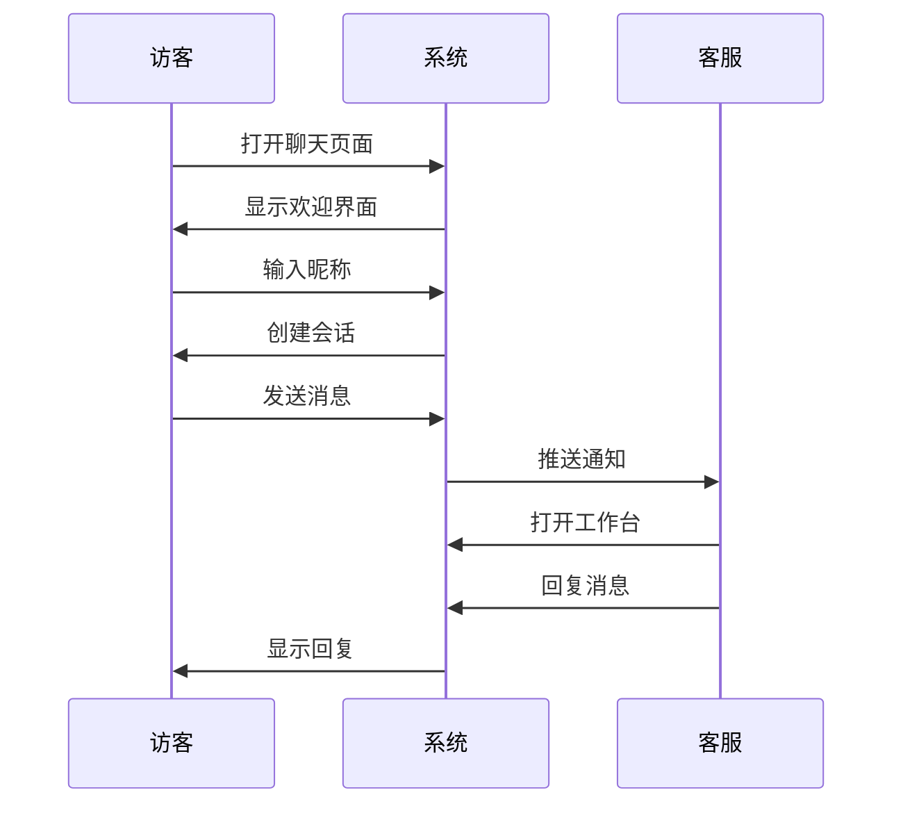
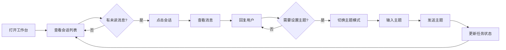

# 交互流程文档

本文档描述系统的核心交互流程和用户操作路径。

---

## 流程1: 访客发起咨询



### 步骤详解

1. **访客打开页面** → 系统显示聊天界面
2. **输入昵称** → 系统创建会话
3. **发送消息** → 消息存储并通知客服
4. **客服回复** → 实时推送给访客

---

## 流程2: 客服接待流程



### 操作步骤

| 步骤 | 操作 | 结果 |
|------|------|------|
| 1 | 打开 `/staff` | 进入工作台 |
| 2 | 查看左侧列表 | 显示所有会话 |
| 3 | 点击会话 | 右侧显示对话 |
| 4 | 输入消息回复 | 实时推送给用户 |

---

## 流程3: 任务进度管理

### 状态流转

```
需求讨论 ──→ 需求确认 ──→ 执行中 ──→ 交付 ──→ 评价
    ↑______________|___________|_________|___|
              (可任意跳转)
```

### 操作方式

1. 客服在聊天窗口顶部看到进度条
2. 点击任意状态节点即可切换
3. 状态实时同步到用户端

### 各状态说明

| 状态 | 客服操作 | 用户看到 |
|------|---------|---------|
| 需求讨论 | 与用户沟通需求 | "客服正在了解您的需求" |
| 需求确认 | 确认需求已明确 | "需求已确认，即将开始处理" |
| 执行中 | 正在处理任务 | "客服正在处理中..." |
| 交付 | 任务完成 | "任务已完成，请确认" |
| 评价 | 等待用户评价 | "请对服务进行评价" |

---

## 流程4: 排队系统

### 用户视角

```
┌─────────────────────────────────┐
│ 排队中 #3 | 预计等待 15 分钟    │
└─────────────────────────────────┘
```

当有多个用户同时咨询时：
1. 系统自动计算排队位置
2. 用户在顶部看到排队信息
3. 排到第一位时，排队信息消失

### 客服视角

```
┌─────────────────────────────────────────┐
│ 任务队列 (5个等待中)              [刷新] │
├─────────────────────────────────────────┤
│ #1 张三 | 登录页面开发 | 执行中 | 5分钟  │
│ #2 李四 | 数据库优化   | 确认   | 10分钟 │
│ #3 王五 | API对接      | 讨论   | 15分钟 │
└─────────────────────────────────────────┘
```

点击队列按钮查看所有待处理会话。

---

## 实时通信

系统使用 Server-Sent Events (SSE) 实现实时通信：

```
┌──────────┐      SSE Connection      ┌──────────┐
│  用户端  │ ◄─────────────────────► │  服务器  │
└──────────┘                          └──────────┘
                                            ▲
                                            │ SSE
┌──────────┐      SSE Connection      ┌────┴─────┐
│  客服端  │ ◄─────────────────────► │  服务器  │
└──────────┘                          └──────────┘
```

### 事件类型

| 事件 | 触发时机 |
|------|---------|
| `message` | 新消息到达 |
| `session_update` | 会话状态更新 |
| `queue_update` | 队列位置变化 |

---

## 界面响应式设计

### PC 端 (≥768px)

- 左右分栏布局
- 会话列表固定在左侧
- 聊天窗口占据主要区域

### 移动端 (<768px)

- 单栏布局
- 会话列表和聊天窗口切换显示
- 底部输入框固定

---

## 错误处理

### 网络断开

1. 系统显示断开提示
2. 自动尝试重连
3. 重连成功后同步消息

### 消息发送失败

1. 显示发送失败标识
2. 点击可重试
3. 消息本地暂存
