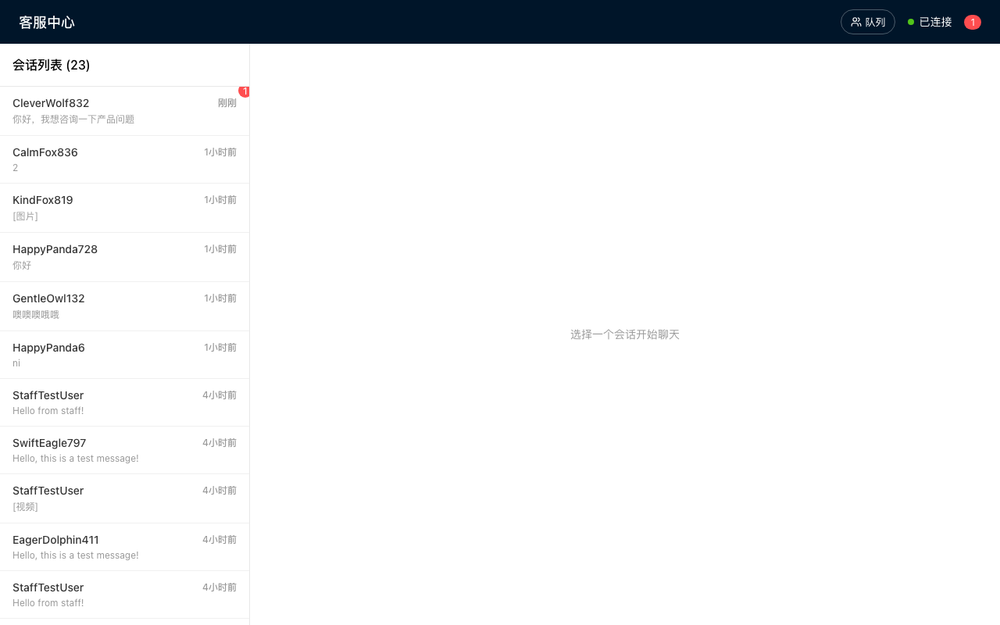
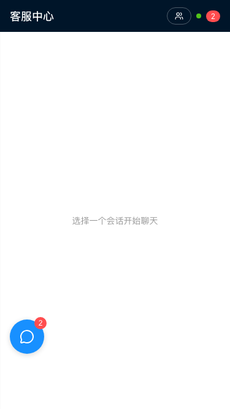

# 客服操作指南

本文档介绍客服人员如何使用工作台进行用户接待和任务管理。

---

## 工作台概览

### 访问客服后台

打开浏览器，访问 `/staff` 路径进入客服工作台。

**PC 端工作台：**



**移动端工作台：**


### 界面布局

工作台分为左右两个区域：
- **左侧**：会话列表，显示所有用户会话
- **右侧**：聊天窗口，与用户对话

---

## 会话管理

### 查看会话列表

会话列表显示：
- 用户昵称
- 最后一条消息预览
- 未读消息数量
- 任务状态标识

### 选中会话

点击会话列表中的项目，右侧会显示与该用户的聊天记录。

**对话界面：**


**移动端对话：**



---

## 消息功能

### 发送消息

在输入框中输入消息，点击发送或按回车键。

### 发送文件

点击附件按钮上传图片或文件给用户。

### 消息模式切换

输入框左侧有模式切换按钮：
- **💬 聊天**：发送普通消息
- **📌 主题**：设置会话主题

---

## 任务管理

### 设置会话主题

1. 切换到「主题」模式
2. 输入任务主题（如："登录页面开发"）
3. 发送后，主题会显示在聊天窗口顶部

### 更新任务进度

点击顶部的进度条，可以切换任务状态：

| 状态 | 说明 |
|------|------|
| 需求讨论 | 与用户沟通需求 |
| 需求确认 | 需求已明确，等待执行 |
| 执行中 | 正在处理任务 |
| 交付 | 任务已完成，等待用户确认 |
| 评价 | 用户已评价 |

### 查看任务队列

点击队列按钮，可以查看所有待处理的会话：
- 排队位置
- 用户信息
- 等待时间
- 任务状态

---

## 通知功能

### 新消息通知

当有新用户消息时：
- 会话列表显示未读标记
- 系统会发送推送通知（如已配置 Bark）

### 配置推送通知

在 `.env` 文件中配置：
```bash
BARK_KEY=your_bark_key
BARK_API=https://api.day.app
STAFF_URL_BASE=http://your-domain/staff
```

---

## 快捷操作

| 操作 | 说明 |
|------|------|
| 点击会话 | 选中并查看对话 |
| 点击进度条 | 切换任务状态 |
| 输入框模式切换 | 聊天/主题模式 |

---

## 常见问题

### Q: 如何处理多个用户同时咨询？

A: 会话列表按活跃度排序，未读会话会有明显标识。建议优先处理等待时间较长的用户。

### Q: 用户离线后消息会丢失吗？

A: 不会。所有消息都会保存，用户上线后可以看到历史记录。

### Q: 如何标记会话为已处理？

A: 将任务状态更新为「评价」表示任务完成。
