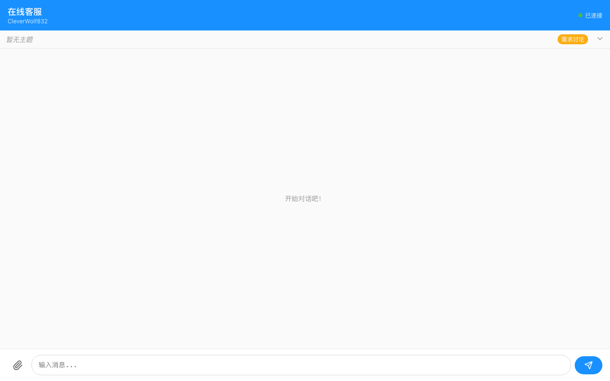
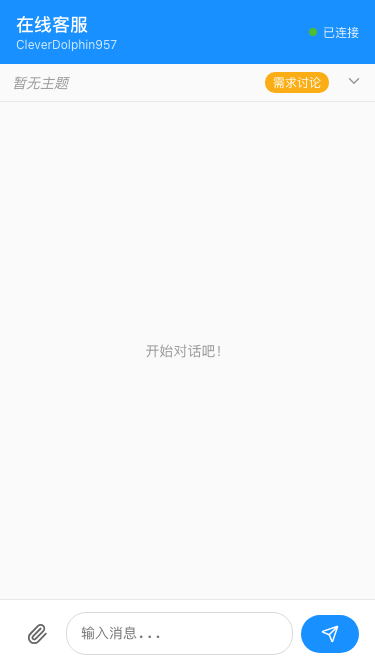

# 用户使用指南

本文档介绍如何使用在线客服聊天系统进行咨询。

---

## 开始对话

### 1. 访问聊天页面

打开浏览器，访问客服聊天页面。系统会自动为您分配一个会话。

**PC 端界面：**

**移动端界面：**

### 2. 输入昵称

首次进入时，输入您的昵称以便客服识别您的身份。

### 3. 发送消息

在输入框中输入您想咨询的问题，点击发送按钮或按回车键发送。

**对话界面：**

**移动端对话：**

---

## 功能说明

### 发送文字消息

在输入框中输入文字，点击发送即可。

### 发送图片/文件

点击输入框旁的附件按钮（📎），选择要发送的图片或文件。

支持的文件类型：
- **图片**：PNG, JPG, GIF, WebP（最大 10MB）
- **视频**：MP4, WebM（最大 50MB）
- **文件**：PDF, ZIP, CSV, DOC, XLS 等（最大 20MB）

### 查看任务进度

当客服为您创建任务后，您可以在聊天窗口顶部看到：
- **任务主题**：当前咨询的主题
- **进度状态**：需求讨论 → 需求确认 → 执行中 → 交付 → 评价

### 排队查询

当有多个用户同时咨询时，系统会显示：
- 您的排队位置
- 预计等待时间

---

## 常见问题

### Q: 消息发送失败怎么办？

A: 请检查网络连接，刷新页面后重试。消息会自动保存。

### Q: 如何查看历史消息？

A: 向上滚动聊天记录即可查看历史消息。系统会自动加载更多。

### Q: 支持哪些浏览器？

A: 支持所有现代浏览器（Chrome, Firefox, Safari, Edge）及移动端浏览器。

---

## 联系支持

如有其他问题，请在聊天中告知客服，我们会尽快为您解决。
